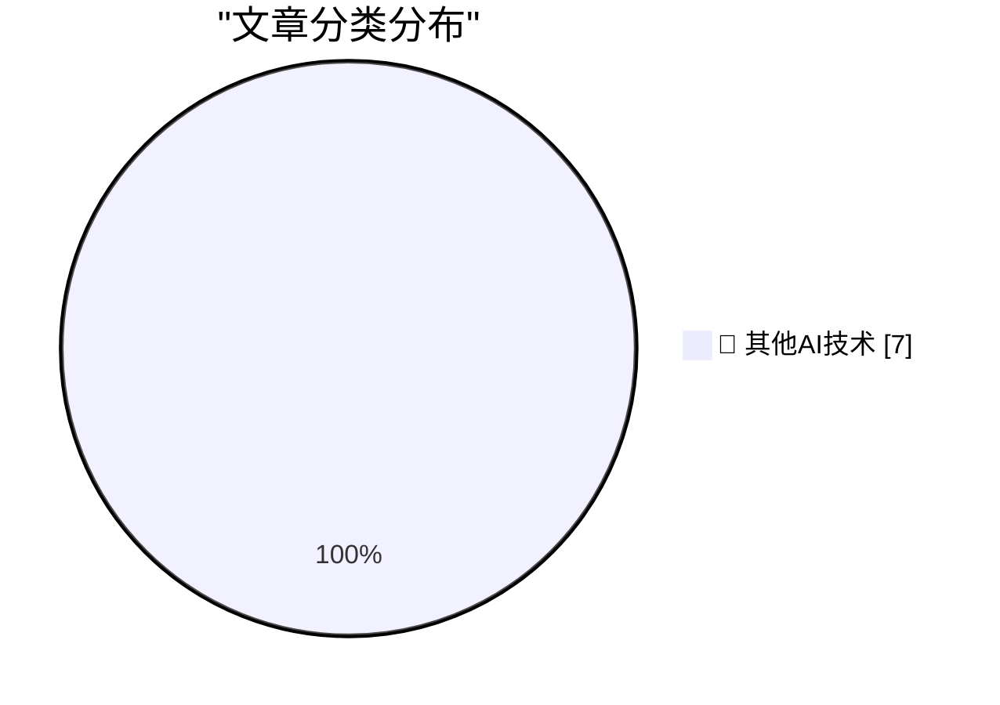

# 📰 AI 博客每日精选 — 2026-10-02

> 来自 98 个技术博客和社交媒体源，AI 精选 Top 7

## 🏆 今日必读

🥇 **Yankees Sweep Boston in Two Games, by Combined Score of 18-2**

[Yankees Sweep Boston in Two Games, by Combined Score of 18-2](https://www.nytimes.com/athletic/7648172/2026/09/30/yankees-beat-red-sox-mlb-wild-card-series/) — daringfireball.net · 23 分钟前 · 🔬 其他AI技术

> Yankees Sweep Boston in Two Games, by Combined Score of 18-2

🥈 **Pluralistic: Voting is to politics as shopping is to boycotts (01 Oct 2026)**

[Pluralistic: Voting is to politics as shopping is to boycotts (01 Oct 2026)](https://pluralistic.net/2026/10/01/data-centers/) — pluralistic.net · 7 小时前 · 🔬 其他AI技术

> Pluralistic: Voting is to politics as shopping is to boycotts (01 Oct 2026)

🥉 **Why do OpenAI's GPT-2 weights beat mine?  Part five: data quality**

[Why do OpenAI's GPT-2 weights beat mine?  Part five: data quality](https://www.gilesthomas.com/2026/10/why-do-openai-gpt2-weights-beat-mine-5-data-quality) — gilesthomas.com · 7 小时前 · 🔬 其他AI技术

> Why do OpenAI's GPT-2 weights beat mine?  Part five: data quality

4️⃣ **Why Americans Stopped Throwing Dinner Parties**

[Why Americans Stopped Throwing Dinner Parties](https://www.theatlantic.com/ideas/2026/10/americans-socialization-dinner-decline-hosting/688846/?utm_source=feed) — derekthompson.org · 13 小时前 · 🔬 其他AI技术

> Why Americans Stopped Throwing Dinner Parties

5️⃣ **Software Heritage Identifiers**

[Software Heritage Identifiers](https://nesbitt.io/2026/10/01/software-heritage-identifiers.html) — nesbitt.io · 13 小时前 · 🔬 其他AI技术

> Software Heritage Identifiers

---

## 📊 数据概览

| 扫描源 | 抓取文章 | 时间范围 | 精选 |
|:---:|:---:|:---:|:---:|
| 62/98 | 1731 篇 → 7 篇 | 24h | **7 篇** |

### 分类分布

---

====================

## 🔬 其他AI技术

### 1. Yankees Sweep Boston in Two Games, by Combined Score of 18-2

[Yankees Sweep Boston in Two Games, by Combined Score of 18-2](https://www.nytimes.com/athletic/7648172/2026/09/30/yankees-beat-red-sox-mlb-wild-card-series/) — **daringfireball.net** · 23 分钟前 · ⭐ 15/25

> Yankees Sweep Boston in Two Games, by Combined Score of 18-2

📌 其他AI技术

---

### 2. Pluralistic: Voting is to politics as shopping is to boycotts (01 Oct 2026)

[Pluralistic: Voting is to politics as shopping is to boycotts (01 Oct 2026)](https://pluralistic.net/2026/10/01/data-centers/) — **pluralistic.net** · 7 小时前 · ⭐ 15/25

> Pluralistic: Voting is to politics as shopping is to boycotts (01 Oct 2026)

📌 其他AI技术

---

### 3. Why do OpenAI's GPT-2 weights beat mine?  Part five: data quality

[Why do OpenAI's GPT-2 weights beat mine?  Part five: data quality](https://www.gilesthomas.com/2026/10/why-do-openai-gpt2-weights-beat-mine-5-data-quality) — **gilesthomas.com** · 7 小时前 · ⭐ 15/25

> Why do OpenAI's GPT-2 weights beat mine?  Part five: data quality

📌 其他AI技术

---

### 4. Why Americans Stopped Throwing Dinner Parties

[Why Americans Stopped Throwing Dinner Parties](https://www.theatlantic.com/ideas/2026/10/americans-socialization-dinner-decline-hosting/688846/?utm_source=feed) — **derekthompson.org** · 13 小时前 · ⭐ 15/25

> Why Americans Stopped Throwing Dinner Parties

📌 其他AI技术

---

### 5. Software Heritage Identifiers

[Software Heritage Identifiers](https://nesbitt.io/2026/10/01/software-heritage-identifiers.html) — **nesbitt.io** · 13 小时前 · ⭐ 15/25

> Software Heritage Identifiers

📌 其他AI技术

---

### 6. Si Sheppard – How did a few hundred Spanish soldiers topple two empires?

[Si Sheppard – How did a few hundred Spanish soldiers topple two empires?](https://www.dwarkesh.com/p/si-sheppard) — **dwarkesh.com** · 9 小时前 · ⭐ 15/25

> Si Sheppard – How did a few hundred Spanish soldiers topple two empires?

📌 其他AI技术

---

### 7. The day GIF became free to use, forever

[The day GIF became free to use, forever](https://dfarq.homeip.net/the-day-gif-became-free-to-use-forever/?utm_source=rss&#038;utm_medium=rss&#038;utm_campaign=the-day-gif-became-free-to-use-forever) — **dfarq.homeip.net** · 13 小时前 · ⭐ 15/25

> The day GIF became free to use, forever

📌 其他AI技术

---

====================

*生成于 2026-10-02 00:30 | 扫描 62 源 → 获取 1731 篇 → 精选 7 篇*
*基于 [Hacker News Popularity Contest 2025](https://refactoringenglish.com/tools/hn-popularity/) RSS 源列表，由 [Andrej Karpathy](https://x.com/karpathy) 推荐*
*由「懂点儿AI」制作，欢迎关注同名微信公众号获取更多 AI 实用技巧 💡*
