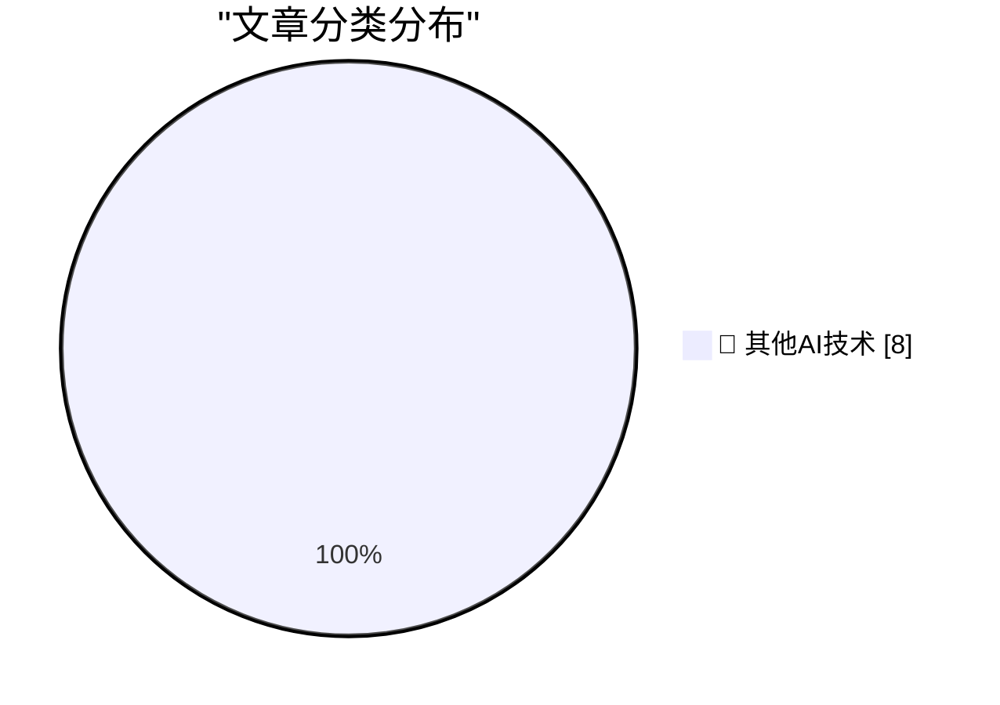

# 📰 AI 博客每日精选 — 2026-10-03

> 来自 98 个技术博客和社交媒体源，AI 精选 Top 8

## 🏆 今日必读

🥇 **Superpersuasion will look like bribery**

[Superpersuasion will look like bribery](https://seangoedecke.com/superpersuasion-will-look-like-bribery/) — seangoedecke.com · 7 分钟前 · 🔬 其他AI技术

> Superpersuasion will look like bribery

🥈 **★ Apple Is Going to Further Tighten the Screws on Full Disk Access on MacOS, in Response to Agentic AI Apps Running Amok**

[★ Apple Is Going to Further Tighten the Screws on Full Disk Access on MacOS, in Response to Agentic AI Apps Running Amok](https://daringfireball.net/2026/10/apple_full_disk_access) — daringfireball.net · 3 小时前 · 🔬 其他AI技术

> ★ Apple Is Going to Further Tighten the Screws on Full Disk Access on MacOS, in Response to Agentic AI Apps Running Amok

🥉 **Gadget Review: Una Watch ★★★★☆**

[Gadget Review: Una Watch ★★★★☆](https://shkspr.mobi/blog/2026/10/gadget-review-una-watch/) — shkspr.mobi · 12 小时前 · 🔬 其他AI技术

> Gadget Review: Una Watch ★★★★☆

4️⃣ **The Brain Sandwich**

[The Brain Sandwich](https://terriblesoftware.org/2026/10/02/the-brain-sandwich/) — terriblesoftware.org · 10 小时前 · 🔬 其他AI技术

> The Brain Sandwich

5️⃣ **Premium: How Has AI Changed The Economy?**

[Premium: How Has AI Changed The Economy?](https://www.wheresyoured.at/premium-how-has-ai-changed-the-economy/) — wheresyoured.at · 5 小时前 · 🔬 其他AI技术

> Premium: How Has AI Changed The Economy?

---

## 📊 数据概览

| 扫描源 | 抓取文章 | 时间范围 | 精选 |
|:---:|:---:|:---:|:---:|
| 64/98 | 1807 篇 → 8 篇 | 24h | **8 篇** |

### 分类分布

---

====================

## 🔬 其他AI技术

### 1. Superpersuasion will look like bribery

[Superpersuasion will look like bribery](https://seangoedecke.com/superpersuasion-will-look-like-bribery/) — **seangoedecke.com** · 7 分钟前 · ⭐ 15/25

> Superpersuasion will look like bribery

📌 其他AI技术

---

### 2. ★ Apple Is Going to Further Tighten the Screws on Full Disk Access on MacOS, in Response to Agentic AI Apps Running Amok

[★ Apple Is Going to Further Tighten the Screws on Full Disk Access on MacOS, in Response to Agentic AI Apps Running Amok](https://daringfireball.net/2026/10/apple_full_disk_access) — **daringfireball.net** · 3 小时前 · ⭐ 15/25

> ★ Apple Is Going to Further Tighten the Screws on Full Disk Access on MacOS, in Response to Agentic AI Apps Running Amok

📌 其他AI技术

---

### 3. Gadget Review: Una Watch ★★★★☆

[Gadget Review: Una Watch ★★★★☆](https://shkspr.mobi/blog/2026/10/gadget-review-una-watch/) — **shkspr.mobi** · 12 小时前 · ⭐ 15/25

> Gadget Review: Una Watch ★★★★☆

📌 其他AI技术

---

### 4. The Brain Sandwich

[The Brain Sandwich](https://terriblesoftware.org/2026/10/02/the-brain-sandwich/) — **terriblesoftware.org** · 10 小时前 · ⭐ 15/25

> The Brain Sandwich

📌 其他AI技术

---

### 5. Premium: How Has AI Changed The Economy?

[Premium: How Has AI Changed The Economy?](https://www.wheresyoured.at/premium-how-has-ai-changed-the-economy/) — **wheresyoured.at** · 5 小时前 · ⭐ 15/25

> Premium: How Has AI Changed The Economy?

📌 其他AI技术

---

### 6. What happened to Activision

[What happened to Activision](https://dfarq.homeip.net/what-happened-to-activision/?utm_source=rss&#038;utm_medium=rss&#038;utm_campaign=what-happened-to-activision) — **dfarq.homeip.net** · 13 小时前 · ⭐ 15/25

> What happened to Activision

📌 其他AI技术

---

### 7. Digitale autonomie in het kort bij KIVI, STT en NAE

[Digitale autonomie in het kort bij KIVI, STT en NAE](https://berthub.eu/articles/posts/praatje-kivi-stt-nae/) — **berthub.eu** · 14 小时前 · ⭐ 15/25

> Digitale autonomie in het kort bij KIVI, STT en NAE

📌 其他AI技术

---

### 8. Make tmux the OS

[Make tmux the OS](https://matduggan.com/what-does-my-dream-os-ui-look-like/) — **matduggan.com** · 13 小时前 · ⭐ 15/25

> Make tmux the OS

📌 其他AI技术

---

====================

*生成于 2026-10-03 00:07 | 扫描 64 源 → 获取 1807 篇 → 精选 8 篇*
*基于 [Hacker News Popularity Contest 2025](https://refactoringenglish.com/tools/hn-popularity/) RSS 源列表，由 [Andrej Karpathy](https://x.com/karpathy) 推荐*
*由「懂点儿AI」制作，欢迎关注同名微信公众号获取更多 AI 实用技巧 💡*
