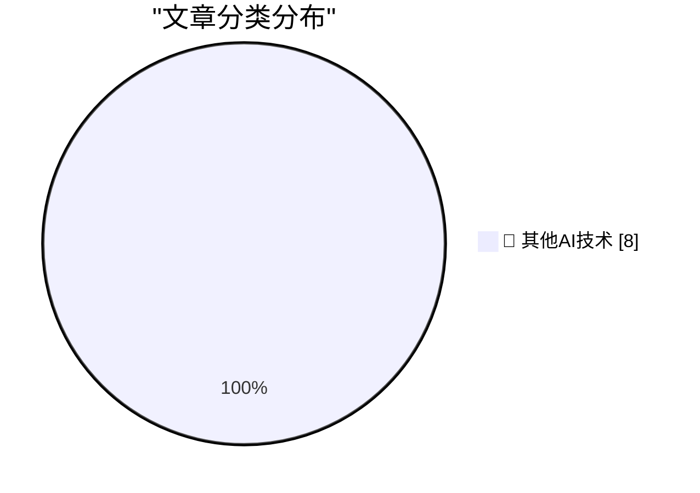

# 📰 AI 博客每日精选 — 2026-10-03

> 来自 98 个技术博客和社交媒体源，AI 精选 Top 8

## 🏆 今日必读

🥇 **Superpersuasion will look like bribery**

[Superpersuasion will look like bribery](https://seangoedecke.com/superpersuasion-will-look-like-bribery/) — seangoedecke.com · 23 小时前 · 🔬 其他AI技术

> Superpersuasion will look like bribery

🥈 **Shipping is the foundation**

[Shipping is the foundation](https://seangoedecke.com/shipping-is-the-foundation/) — seangoedecke.com · 23 小时前 · 🔬 其他AI技术

> Shipping is the foundation

🥉 **WorkOS**

[WorkOS](https://workos.com/guide/the-developers-guide-to-sso?utm_source=daringfireball&amp;utm_medium=newsletter&amp;utm_campaign=q32026) — daringfireball.net · 2 小时前 · 🔬 其他AI技术

> WorkOS

4️⃣ **Apple Confirms iPhone 18 Pro Max AT&T Cellular Issues, Affected Devices Require Hardware Replacement**

[Apple Confirms iPhone 18 Pro Max AT&T Cellular Issues, Affected Devices Require Hardware Replacement](https://9to5mac.com/2026/10/02/apple-confirms-iphone-18-pro-max-att-cellular-issues-affected-devices-require-hardware-replacement/) — daringfireball.net · 5 小时前 · 🔬 其他AI技术

> Apple Confirms iPhone 18 Pro Max AT&T Cellular Issues, Affected Devices Require Hardware Replacement

5️⃣ **Pluralistic: Economic probabilities for our grandchildren (03 Oct 2026)**

[Pluralistic: Economic probabilities for our grandchildren (03 Oct 2026)](https://pluralistic.net/2026/10/03/full-employment/) — pluralistic.net · 11 小时前 · 🔬 其他AI技术

> Pluralistic: Economic probabilities for our grandchildren (03 Oct 2026)

---

## 📊 数据概览

| 扫描源 | 抓取文章 | 时间范围 | 精选 |
|:---:|:---:|:---:|:---:|
| 64/98 | 1807 篇 → 8 篇 | 24h | **8 篇** |

### 分类分布

---

====================

## 🔬 其他AI技术

### 1. Superpersuasion will look like bribery

[Superpersuasion will look like bribery](https://seangoedecke.com/superpersuasion-will-look-like-bribery/) — **seangoedecke.com** · 23 小时前 · ⭐ 15/25

> Superpersuasion will look like bribery

📌 其他AI技术

---

### 2. Shipping is the foundation

[Shipping is the foundation](https://seangoedecke.com/shipping-is-the-foundation/) — **seangoedecke.com** · 23 小时前 · ⭐ 15/25

> Shipping is the foundation

📌 其他AI技术

---

### 3. WorkOS

[WorkOS](https://workos.com/guide/the-developers-guide-to-sso?utm_source=daringfireball&amp;utm_medium=newsletter&amp;utm_campaign=q32026) — **daringfireball.net** · 2 小时前 · ⭐ 15/25

> WorkOS

📌 其他AI技术

---

### 4. Apple Confirms iPhone 18 Pro Max AT&T Cellular Issues, Affected Devices Require Hardware Replacement

[Apple Confirms iPhone 18 Pro Max AT&T Cellular Issues, Affected Devices Require Hardware Replacement](https://9to5mac.com/2026/10/02/apple-confirms-iphone-18-pro-max-att-cellular-issues-affected-devices-require-hardware-replacement/) — **daringfireball.net** · 5 小时前 · ⭐ 15/25

> Apple Confirms iPhone 18 Pro Max AT&T Cellular Issues, Affected Devices Require Hardware Replacement

📌 其他AI技术

---

### 5. Pluralistic: Economic probabilities for our grandchildren (03 Oct 2026)

[Pluralistic: Economic probabilities for our grandchildren (03 Oct 2026)](https://pluralistic.net/2026/10/03/full-employment/) — **pluralistic.net** · 11 小时前 · ⭐ 15/25

> Pluralistic: Economic probabilities for our grandchildren (03 Oct 2026)

📌 其他AI技术

---

### 6. This Week in Package Management: 3 October 2026

[This Week in Package Management: 3 October 2026](https://nesbitt.io/2026/10/03/this-week-in-package-management.html) — **nesbitt.io** · 13 小时前 · ⭐ 15/25

> This Week in Package Management: 3 October 2026

📌 其他AI技术

---

### 7. Connect Sony WH-1000XM3 on Arch Linux and a buggy UGREEN Bluetooth adapter

[Connect Sony WH-1000XM3 on Arch Linux and a buggy UGREEN Bluetooth adapter](https://jayd.ml/2026/10/03/sony-headphones-action-bluetooth-adapter.html) — **jayd.ml** · 14 小时前 · ⭐ 15/25

> Connect Sony WH-1000XM3 on Arch Linux and a buggy UGREEN Bluetooth adapter

📌 其他AI技术

---

### 8. Cull lumber at Menards

[Cull lumber at Menards](https://dfarq.homeip.net/cull-lumber-at-menards/?utm_source=rss&#038;utm_medium=rss&#038;utm_campaign=cull-lumber-at-menards) — **dfarq.homeip.net** · 12 小时前 · ⭐ 15/25

> Cull lumber at Menards

📌 其他AI技术

---

====================

*生成于 2026-10-03 23:30 | 扫描 64 源 → 获取 1807 篇 → 精选 8 篇*
*基于 [Hacker News Popularity Contest 2025](https://refactoringenglish.com/tools/hn-popularity/) RSS 源列表，由 [Andrej Karpathy](https://x.com/karpathy) 推荐*
*由「懂点儿AI」制作，欢迎关注同名微信公众号获取更多 AI 实用技巧 💡*
