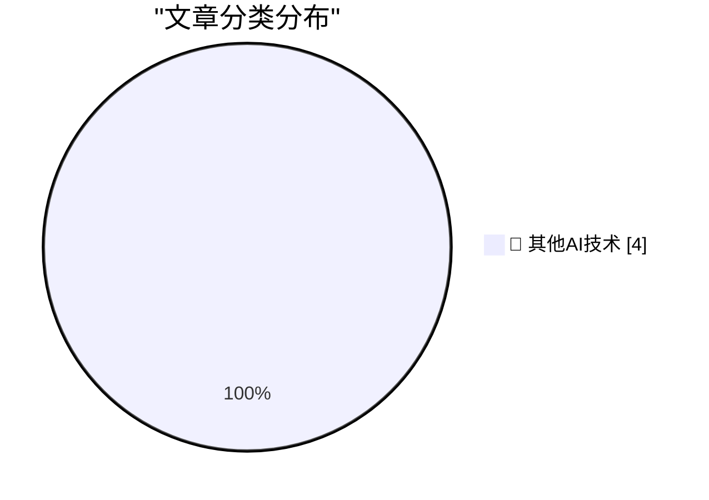

# 📰 AI 博客每日精选 — 2026-10-04

> 来自 98 个技术博客和社交媒体源，AI 精选 Top 4

## 🏆 今日必读

🥇 **Why My Asus Laptop Kept Rebooting After Sleep and How to Fix it**

[Why My Asus Laptop Kept Rebooting After Sleep and How to Fix it](https://idiallo.com/blog/asus-laptop-keeps-rebooting-after-sleep) — idiallo.com · 21 小时前 · 🔬 其他AI技术

> Why My Asus Laptop Kept Rebooting After Sleep and How to Fix it

🥈 **My Pitch for the New Season of Doctor Who**

[My Pitch for the New Season of Doctor Who](https://shkspr.mobi/blog/2026/10/my-pitch-for-the-new-season-of-doctor-who/) — shkspr.mobi · 12 小时前 · 🔬 其他AI技术

> My Pitch for the New Season of Doctor Who

🥉 **Weekend content through the end of 2026**

[Weekend content through the end of 2026](https://dfarq.homeip.net/weekend-content-through-the-end-of-2026/?utm_source=rss&#038;utm_medium=rss&#038;utm_campaign=weekend-content-through-the-end-of-2026) — dfarq.homeip.net · 10 小时前 · 🔬 其他AI技术

> Weekend content through the end of 2026

4️⃣ **Zenith Data Systems, Part I**

[Zenith Data Systems, Part I](https://www.abortretry.fail/p/zenith-data-systems-part-i) — abortretry.fail · 1 小时前 · 🔬 其他AI技术

> Zenith Data Systems, Part I

---

## 📊 数据概览

| 扫描源 | 抓取文章 | 时间范围 | 精选 |
|:---:|:---:|:---:|:---:|
| 64/98 | 1807 篇 → 4 篇 | 24h | **4 篇** |

### 分类分布

---

====================

## 🔬 其他AI技术

### 1. Why My Asus Laptop Kept Rebooting After Sleep and How to Fix it

[Why My Asus Laptop Kept Rebooting After Sleep and How to Fix it](https://idiallo.com/blog/asus-laptop-keeps-rebooting-after-sleep) — **idiallo.com** · 21 小时前 · ⭐ 15/25

> Why My Asus Laptop Kept Rebooting After Sleep and How to Fix it

📌 其他AI技术

---

### 2. My Pitch for the New Season of Doctor Who

[My Pitch for the New Season of Doctor Who](https://shkspr.mobi/blog/2026/10/my-pitch-for-the-new-season-of-doctor-who/) — **shkspr.mobi** · 12 小时前 · ⭐ 15/25

> My Pitch for the New Season of Doctor Who

📌 其他AI技术

---

### 3. Weekend content through the end of 2026

[Weekend content through the end of 2026](https://dfarq.homeip.net/weekend-content-through-the-end-of-2026/?utm_source=rss&#038;utm_medium=rss&#038;utm_campaign=weekend-content-through-the-end-of-2026) — **dfarq.homeip.net** · 10 小时前 · ⭐ 15/25

> Weekend content through the end of 2026

📌 其他AI技术

---

### 4. Zenith Data Systems, Part I

[Zenith Data Systems, Part I](https://www.abortretry.fail/p/zenith-data-systems-part-i) — **abortretry.fail** · 1 小时前 · ⭐ 15/25

> Zenith Data Systems, Part I

📌 其他AI技术

---

====================

*生成于 2026-10-04 23:48 | 扫描 64 源 → 获取 1807 篇 → 精选 4 篇*
*基于 [Hacker News Popularity Contest 2025](https://refactoringenglish.com/tools/hn-popularity/) RSS 源列表，由 [Andrej Karpathy](https://x.com/karpathy) 推荐*
*由「懂点儿AI」制作，欢迎关注同名微信公众号获取更多 AI 实用技巧 💡*
