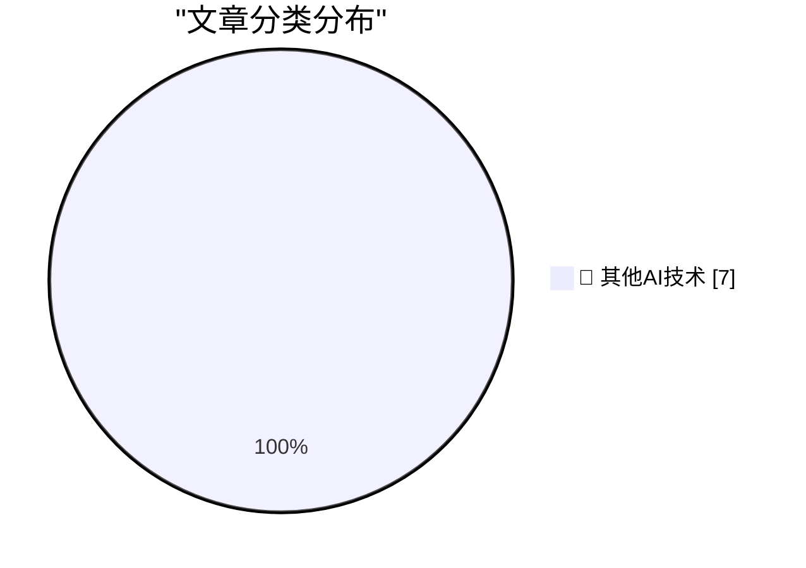

# 📰 AI 博客每日精选 — 2026-10-07

> 来自 98 个技术博客和社交媒体源，AI 精选 Top 7

## 🏆 今日必读

🥇 **Unofficial Command-Line Tool Removes Apple Intelligence From MacOS 27**

[Unofficial Command-Line Tool Removes Apple Intelligence From MacOS 27](https://arstechnica.com/apple/2026/10/command-line-tool-quickly-removes-apple-intelligence-from-macos-27/) — daringfireball.net · 6 小时前 · 🔬 其他AI技术

> Unofficial Command-Line Tool Removes Apple Intelligence From MacOS 27

🥈 **Steve Jobs, Walking Through a Mockup for Apple Park in 2010**

[Steve Jobs, Walking Through a Mockup for Apple Park in 2010](https://book.stevejobsarchive.com/#photo-37) — daringfireball.net · 21 小时前 · 🔬 其他AI技术

> Steve Jobs, Walking Through a Mockup for Apple Park in 2010

🥉 **Pluralistic: Swapping money for expertise (06 Oct 2026)**

[Pluralistic: Swapping money for expertise (06 Oct 2026)](https://pluralistic.net/2026/10/06/nonfungible/) — pluralistic.net · 11 小时前 · 🔬 其他AI技术

> Pluralistic: Swapping money for expertise (06 Oct 2026)

4️⃣ **Una Watch - SDK and Writing Your First App**

[Una Watch - SDK and Writing Your First App](https://shkspr.mobi/blog/2026/10/una-watch-sdk-and-writing-your-first-app/) — shkspr.mobi · 12 小时前 · 🔬 其他AI技术

> Una Watch - SDK and Writing Your First App

5️⃣ **Credit Crunch**

[Credit Crunch](https://www.wheresyoured.at/credit-crunch/) — wheresyoured.at · 9 小时前 · 🔬 其他AI技术

> Credit Crunch

---

## 📊 数据概览

| 扫描源 | 抓取文章 | 时间范围 | 精选 |
|:---:|:---:|:---:|:---:|
| 64/98 | 1808 篇 → 7 篇 | 24h | **7 篇** |

### 分类分布

---

====================

## 🔬 其他AI技术

### 1. Unofficial Command-Line Tool Removes Apple Intelligence From MacOS 27

[Unofficial Command-Line Tool Removes Apple Intelligence From MacOS 27](https://arstechnica.com/apple/2026/10/command-line-tool-quickly-removes-apple-intelligence-from-macos-27/) — **daringfireball.net** · 6 小时前 · ⭐ 15/25

> Unofficial Command-Line Tool Removes Apple Intelligence From MacOS 27

📌 其他AI技术

---

### 2. Steve Jobs, Walking Through a Mockup for Apple Park in 2010

[Steve Jobs, Walking Through a Mockup for Apple Park in 2010](https://book.stevejobsarchive.com/#photo-37) — **daringfireball.net** · 21 小时前 · ⭐ 15/25

> Steve Jobs, Walking Through a Mockup for Apple Park in 2010

📌 其他AI技术

---

### 3. Pluralistic: Swapping money for expertise (06 Oct 2026)

[Pluralistic: Swapping money for expertise (06 Oct 2026)](https://pluralistic.net/2026/10/06/nonfungible/) — **pluralistic.net** · 11 小时前 · ⭐ 15/25

> Pluralistic: Swapping money for expertise (06 Oct 2026)

📌 其他AI技术

---

### 4. Una Watch - SDK and Writing Your First App

[Una Watch - SDK and Writing Your First App](https://shkspr.mobi/blog/2026/10/una-watch-sdk-and-writing-your-first-app/) — **shkspr.mobi** · 12 小时前 · ⭐ 15/25

> Una Watch - SDK and Writing Your First App

📌 其他AI技术

---

### 5. Credit Crunch

[Credit Crunch](https://www.wheresyoured.at/credit-crunch/) — **wheresyoured.at** · 9 小时前 · ⭐ 15/25

> Credit Crunch

📌 其他AI技术

---

### 6. Apple’s App Icon HOA

[Apple’s App Icon HOA](https://blog.jim-nielsen.com/2026/app-icon-hoa/) — **blog.jim-nielsen.com** · 5 小时前 · ⭐ 15/25

> Apple’s App Icon HOA

📌 其他AI技术

---

### 7. Lotus: Second largest software publisher in the world (in 1983)

[Lotus: Second largest software publisher in the world (in 1983)](https://dfarq.homeip.net/lotus-second-largest-software-publisher-in-the-world-in-1983/?utm_source=rss&#038;utm_medium=rss&#038;utm_campaign=lotus-second-largest-software-publisher-in-the-world-in-1983) — **dfarq.homeip.net** · 13 小时前 · ⭐ 15/25

> Lotus: Second largest software publisher in the world (in 1983)

📌 其他AI技术

---

====================

*生成于 2026-10-07 00:20 | 扫描 64 源 → 获取 1808 篇 → 精选 7 篇*
*基于 [Hacker News Popularity Contest 2025](https://refactoringenglish.com/tools/hn-popularity/) RSS 源列表，由 [Andrej Karpathy](https://x.com/karpathy) 推荐*
*由「懂点儿AI」制作，欢迎关注同名微信公众号获取更多 AI 实用技巧 💡*
