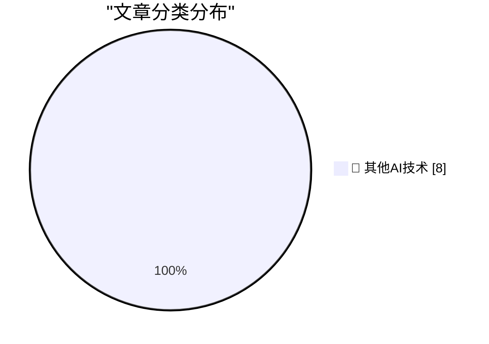

# 📰 AI 博客每日精选 — 2026-10-09

> 来自 98 个技术博客和社交媒体源，AI 精选 Top 8

## 🏆 今日必读

🥇 **Let’s Check In on Trump’s Blog**

[Let’s Check In on Trump’s Blog](https://truthsocial.com/@realDonaldTrump/posts/117406176604364910) — daringfireball.net · 2 小时前 · 🔬 其他AI技术

> Let’s Check In on Trump’s Blog

🥈 **Apple Is Slow-Rolling iOS 27 Adoption, So Far**

[Apple Is Slow-Rolling iOS 27 Adoption, So Far](https://mastodon.social/@_Davidsmith/117355154519434137) — daringfireball.net · 5 小时前 · 🔬 其他AI技术

> Apple Is Slow-Rolling iOS 27 Adoption, So Far

🥉 **Joz Announces ‘Welcome Home’ Keynote Coming Tuesday, 13 October**

[Joz Announces ‘Welcome Home’ Keynote Coming Tuesday, 13 October](https://x.com/gregjoz/status/2108226096407994858) — daringfireball.net · 5 小时前 · 🔬 其他AI技术

> Joz Announces ‘Welcome Home’ Keynote Coming Tuesday, 13 October

4️⃣ **Theatre Review: Hay Fever at Wyndham's Theatre ★★★★⯪**

[Theatre Review: Hay Fever at Wyndham's Theatre ★★★★⯪](https://shkspr.mobi/blog/2026/10/theatre-review-hay-fever-at-wyndhams-theatre/) — shkspr.mobi · 13 小时前 · 🔬 其他AI技术

> Theatre Review: Hay Fever at Wyndham's Theatre ★★★★⯪

5️⃣ **Get Player Stats From Your Minecraft Server Logs**

[Get Player Stats From Your Minecraft Server Logs](https://jayd.ml/2026/10/08/minecraft-log-analyzer.html) — jayd.ml · 6 小时前 · 🔬 其他AI技术

> Get Player Stats From Your Minecraft Server Logs

---

## 📊 数据概览

| 扫描源 | 抓取文章 | 时间范围 | 精选 |
|:---:|:---:|:---:|:---:|
| 63/98 | 1780 篇 → 8 篇 | 24h | **8 篇** |

### 分类分布

---

====================

## 🔬 其他AI技术

### 1. Let’s Check In on Trump’s Blog

[Let’s Check In on Trump’s Blog](https://truthsocial.com/@realDonaldTrump/posts/117406176604364910) — **daringfireball.net** · 2 小时前 · ⭐ 15/25

> Let’s Check In on Trump’s Blog

📌 其他AI技术

---

### 2. Apple Is Slow-Rolling iOS 27 Adoption, So Far

[Apple Is Slow-Rolling iOS 27 Adoption, So Far](https://mastodon.social/@_Davidsmith/117355154519434137) — **daringfireball.net** · 5 小时前 · ⭐ 15/25

> Apple Is Slow-Rolling iOS 27 Adoption, So Far

📌 其他AI技术

---

### 3. Joz Announces ‘Welcome Home’ Keynote Coming Tuesday, 13 October

[Joz Announces ‘Welcome Home’ Keynote Coming Tuesday, 13 October](https://x.com/gregjoz/status/2108226096407994858) — **daringfireball.net** · 5 小时前 · ⭐ 15/25

> Joz Announces ‘Welcome Home’ Keynote Coming Tuesday, 13 October

📌 其他AI技术

---

### 4. Theatre Review: Hay Fever at Wyndham's Theatre ★★★★⯪

[Theatre Review: Hay Fever at Wyndham's Theatre ★★★★⯪](https://shkspr.mobi/blog/2026/10/theatre-review-hay-fever-at-wyndhams-theatre/) — **shkspr.mobi** · 13 小时前 · ⭐ 15/25

> Theatre Review: Hay Fever at Wyndham's Theatre ★★★★⯪

📌 其他AI技术

---

### 5. Get Player Stats From Your Minecraft Server Logs

[Get Player Stats From Your Minecraft Server Logs](https://jayd.ml/2026/10/08/minecraft-log-analyzer.html) — **jayd.ml** · 6 小时前 · ⭐ 15/25

> Get Player Stats From Your Minecraft Server Logs

📌 其他AI技术

---

### 6. “Getting off the Modernization Treadmill”

[“Getting off the Modernization Treadmill”](https://blog.jim-nielsen.com/2026/talk-notes-modernization-treadmill/) — **blog.jim-nielsen.com** · 5 小时前 · ⭐ 15/25

> “Getting off the Modernization Treadmill”

📌 其他AI技术

---

### 7. When Apple Records sued Apple Computer

[When Apple Records sued Apple Computer](https://dfarq.homeip.net/when-apple-records-sued-apple-computer/?utm_source=rss&#038;utm_medium=rss&#038;utm_campaign=when-apple-records-sued-apple-computer) — **dfarq.homeip.net** · 13 小时前 · ⭐ 15/25

> When Apple Records sued Apple Computer

📌 其他AI技术

---

### 8. Monte-Carlo simulations

[Monte-Carlo simulations](https://eli.thegreenplace.net/2026/monte-carlo-simulations/) — **eli.thegreenplace.net** · 22 小时前 · ⭐ 15/25

> Monte-Carlo simulations

📌 其他AI技术

---

====================

*生成于 2026-10-09 00:56 | 扫描 63 源 → 获取 1780 篇 → 精选 8 篇*
*基于 [Hacker News Popularity Contest 2025](https://refactoringenglish.com/tools/hn-popularity/) RSS 源列表，由 [Andrej Karpathy](https://x.com/karpathy) 推荐*
*由「懂点儿AI」制作，欢迎关注同名微信公众号获取更多 AI 实用技巧 💡*
