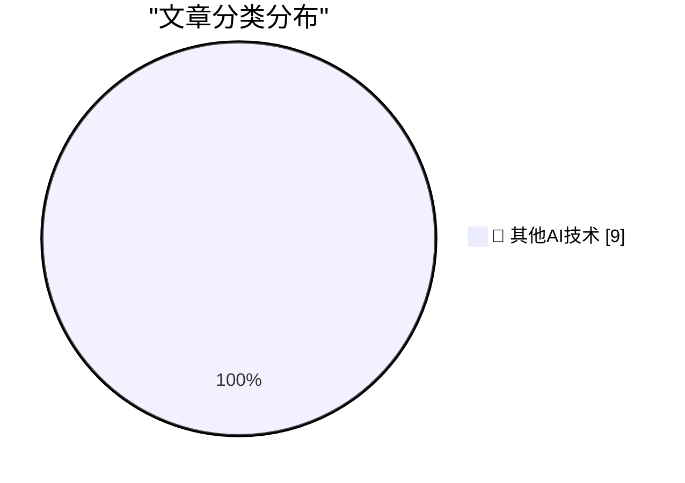

# 📰 AI 博客每日精选 — 2026-10-10

> 来自 98 个技术博客和社交媒体源，AI 精选 Top 9

## 🏆 今日必读

🥇 **Radxa's Q8B has 2x the performance and expansion of the Pi 5**

[Radxa's Q8B has 2x the performance and expansion of the Pi 5](https://www.jeffgeerling.com/blog/2026/radxa-q8b-double-pi-5/) — jeffgeerling.com · 4 小时前 · 🔬 其他AI技术

> Radxa's Q8B has 2x the performance and expansion of the Pi 5

🥈 **Software's centaur age may last decades**

[Software's centaur age may last decades](https://seangoedecke.com/softwares-centaur-age-may-last-decades/) — seangoedecke.com · 28 分钟前 · 🔬 其他AI技术

> Software's centaur age may last decades

🥉 **20 Minutes of Political Debate, Brought to You by Commercial Breaks**

[20 Minutes of Political Debate, Brought to You by Commercial Breaks](https://idiallo.com/byte-size/20-minutes-of-political-debate) — idiallo.com · 19 小时前 · 🔬 其他AI技术

> 20 Minutes of Political Debate, Brought to You by Commercial Breaks

4️⃣ **Pluralistic: Thwarted (09 Oct 2026)**

[Pluralistic: Thwarted (09 Oct 2026)](https://pluralistic.net/2026/10/09/impunitism/) — pluralistic.net · 4 小时前 · 🔬 其他AI技术

> Pluralistic: Thwarted (09 Oct 2026)

5️⃣ **Concert Review: London Voices - Video Games Go Choral ★★★★☆**

[Concert Review: London Voices - Video Games Go Choral ★★★★☆](https://shkspr.mobi/blog/2026/10/concert-review-london-voices-video-games-go-choral/) — shkspr.mobi · 12 小时前 · 🔬 其他AI技术

> Concert Review: London Voices - Video Games Go Choral ★★★★☆

---

## 📊 数据概览

| 扫描源 | 抓取文章 | 时间范围 | 精选 |
|:---:|:---:|:---:|:---:|
| 64/98 | 1810 篇 → 9 篇 | 24h | **9 篇** |

### 分类分布

---

====================

## 🔬 其他AI技术

### 1. Radxa's Q8B has 2x the performance and expansion of the Pi 5

[Radxa's Q8B has 2x the performance and expansion of the Pi 5](https://www.jeffgeerling.com/blog/2026/radxa-q8b-double-pi-5/) — **jeffgeerling.com** · 4 小时前 · ⭐ 15/25

> Radxa's Q8B has 2x the performance and expansion of the Pi 5

📌 其他AI技术

---

### 2. Software's centaur age may last decades

[Software's centaur age may last decades](https://seangoedecke.com/softwares-centaur-age-may-last-decades/) — **seangoedecke.com** · 28 分钟前 · ⭐ 15/25

> Software's centaur age may last decades

📌 其他AI技术

---

### 3. 20 Minutes of Political Debate, Brought to You by Commercial Breaks

[20 Minutes of Political Debate, Brought to You by Commercial Breaks](https://idiallo.com/byte-size/20-minutes-of-political-debate) — **idiallo.com** · 19 小时前 · ⭐ 15/25

> 20 Minutes of Political Debate, Brought to You by Commercial Breaks

📌 其他AI技术

---

### 4. Pluralistic: Thwarted (09 Oct 2026)

[Pluralistic: Thwarted (09 Oct 2026)](https://pluralistic.net/2026/10/09/impunitism/) — **pluralistic.net** · 4 小时前 · ⭐ 15/25

> Pluralistic: Thwarted (09 Oct 2026)

📌 其他AI技术

---

### 5. Concert Review: London Voices - Video Games Go Choral ★★★★☆

[Concert Review: London Voices - Video Games Go Choral ★★★★☆](https://shkspr.mobi/blog/2026/10/concert-review-london-voices-video-games-go-choral/) — **shkspr.mobi** · 12 小时前 · ⭐ 15/25

> Concert Review: London Voices - Video Games Go Choral ★★★★☆

📌 其他AI技术

---

### 6. Fun with low-rank vocab matrices (and a bonus test loss reduction?)

[Fun with low-rank vocab matrices (and a bonus test loss reduction?)](https://www.gilesthomas.com/2026/10/low-rank-vocab-matrices) — **gilesthomas.com** · 8 小时前 · ⭐ 15/25

> Fun with low-rank vocab matrices (and a bonus test loss reduction?)

📌 其他AI技术

---

### 7. Premium: The Hater's Guide To Junk

[Premium: The Hater's Guide To Junk](https://www.wheresyoured.at/premium-the-haters-guide-to-junk/) — **wheresyoured.at** · 8 小时前 · ⭐ 15/25

> Premium: The Hater's Guide To Junk

📌 其他AI技术

---

### 8. An Ion Storm!, Part 1: The Ascent to Gamer Paradise

[An Ion Storm!, Part 1: The Ascent to Gamer Paradise](https://www.filfre.net/2026/10/an-ion-storm-part-1-the-gamers-penthouse/) — **filfre.net** · 8 小时前 · ⭐ 15/25

> An Ion Storm!, Part 1: The Ascent to Gamer Paradise

📌 其他AI技术

---

### 9. Commodore’s knockoff Atari joystick from 1982

[Commodore’s knockoff Atari joystick from 1982](https://dfarq.homeip.net/commodores-knockoff-atari-joystick-from-1982/?utm_source=rss&#038;utm_medium=rss&#038;utm_campaign=commodores-knockoff-atari-joystick-from-1982) — **dfarq.homeip.net** · 13 小时前 · ⭐ 15/25

> Commodore’s knockoff Atari joystick from 1982

📌 其他AI技术

---

====================

*生成于 2026-10-10 00:28 | 扫描 64 源 → 获取 1810 篇 → 精选 9 篇*
*基于 [Hacker News Popularity Contest 2025](https://refactoringenglish.com/tools/hn-popularity/) RSS 源列表，由 [Andrej Karpathy](https://x.com/karpathy) 推荐*
*由「懂点儿AI」制作，欢迎关注同名微信公众号获取更多 AI 实用技巧 💡*
